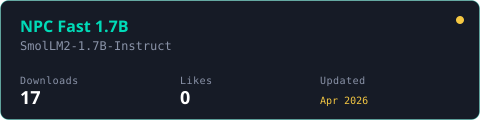
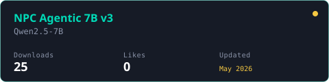
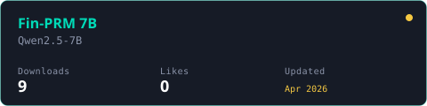
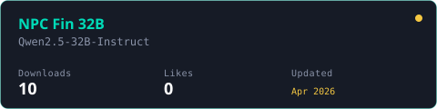

# Rama Krishna Bachu

Building [Bottensor](https://bottensor.xyz) (open-source small-model research) and [BigBugAI](https://bigbug.ai) (local-first financial reasoning). Software engineer, 7+ years. MS in Computer Science from the University of New Haven.

---

## Currently building

**Bottensor** — open-source small-model research. The NPC family (cards below) trains and serves under one stack: training scripts in [bottensor-models](https://github.com/ramankrishna/bottensor-models), routing in [npc-mom-router](https://github.com/ramankrishna/npc-mom-router) (PyPI), multi-agent orchestration in [bottensor-fleet](https://github.com/ramankrishna/bottensor-fleet) (PyPI). Public site: [bottensor.xyz](https://bottensor.xyz).

**BigBugAI** — local-first financial reasoning research on Apple Silicon. Multi-agent system over a small base model. Live at [bigbug.ai](https://bigbug.ai). Tech lead, builder.

**polyrt** — unified LLM runtime utility. One API across MLX (local), Anthropic, and OpenAI. v0.1.0 shipped 2026-04-27. [Source](https://github.com/ramankrishna/polyRT).

---

## Career

**Lowe's, Charlotte NC** — Event-driven microservices processing 1M+ Kafka events for promotions and payments. High-throughput data sync across Postgres and Couchbase. Observability dashboards in Grafana. Batch systems handling 10M+ digital gift cards.

**Accenture, Hyderabad** — Scalable data ingestion with Redis / Solr / Kafka — 140% query performance improvement across 100M+ requests. AWS S3 file pipelines with Avro. Fault-tolerant microservices with dead-letter queues serving 20M+ users.

---

## Published research

**[NPC Agentic 7B v3 — benchmark harness](https://doi.org/10.5281/zenodo.19954103)** (2026). Compares Qwen2.5-7B-Instruct against NPC Agentic 7B v3 on BFCL v4, IFEval, and AgentBench OS+DB under identical vLLM 0.6.3 GPTQ W4A16 serving. Source: [bench-npc-agentic-v3](https://github.com/ramankrishna/bench-npc-agentic-v3).

---

## Models on HuggingFace

Live download stats from the HuggingFace API, refreshed weekly.

  
  

  
  

Profile on <a href="https://huggingface.co/ramankrishna10">huggingface.co/ramankrishna10</a>

---

## Open source

**Bottensor**
- [bottensor-models](https://github.com/ramankrishna/bottensor-models) — Training scripts and configs for the NPC model family
- [npc-mom-router](https://github.com/ramankrishna/npc-mom-router) — Plug-and-play Mixture-of-Models router with real cost tracking (PyPI)
- [bottensor-fleet](https://github.com/ramankrishna/bottensor-fleet) — Graph-native multi-agent fleet for Python (PyPI)
- [bench-npc-agentic-v3](https://github.com/ramankrishna/bench-npc-agentic-v3) — NPC Agentic v3 benchmark harness (Zenodo paper)

**@bottensor scope on npm**
- [cogito](https://github.com/ramankrishna/cogito) — Multi-strategy reasoning (ReAct, Chain-of-Thought, Tree-of-Thought) over HuggingFace and OpenAI-compatible backends
- [engram](https://github.com/ramankrishna/engram) — Graph-based agent memory, short-term + long-term, with local or Voyage AI backends
- [forge](https://github.com/ramankrishna/forge) — Open agentic framework with skills-as-markdown and pluggable LLM providers

**Standalone**
- [polyRT](https://github.com/ramankrishna/polyRT) — Unified LLM runtime (MLX + Anthropic + OpenAI)

---

## Past work

Java and systems portfolio from earlier roles:

- [orderMicroServiceDemo](https://github.com/ramankrishna/orderMicroServiceDemo) — REST microservices for order processing (Cart / Order / Invoice / ERP)
- [Pre-trained-classifier-Project](https://github.com/ramankrishna/Pre-trained-classifier-Project) — Image classification with AlexNet, VGG16, ResNet
- [RedisImplementation](https://github.com/ramankrishna/RedisImplementation) — Redis from scratch in Java
- [NodesApi](https://github.com/ramankrishna/NodesApi) — Distributed nodes REST API
- [JavaDSAlgos](https://github.com/ramankrishna/JavaDSAlgos) — Data structures and algorithms in Java

---

## Tech stack

**Languages:** Python, Java, C++, TypeScript, Shell

**ML / inference:** PyTorch, vLLM, MLX, HuggingFace Transformers, GPTQ / AWQ quantization

**Backend:** Spring Boot, Flask, Node.js, FastAPI

**Distributed:** Kafka, Redis, Spark, Airflow

**Databases:** MongoDB, Postgres, MySQL, Cassandra

**Cloud & infra:** AWS, GCP, Kubernetes, Heroku, Vercel, RunPod

---

## Connect

- LinkedIn: [ramakrishna-bachu10](https://www.linkedin.com/in/ramakrishna-bachu10/)
- Email: [ramakrishna.bachu1@gmail.com](mailto:ramakrishna.bachu1@gmail.com)
- HuggingFace: [@ramankrishna10](https://huggingface.co/ramankrishna10)
