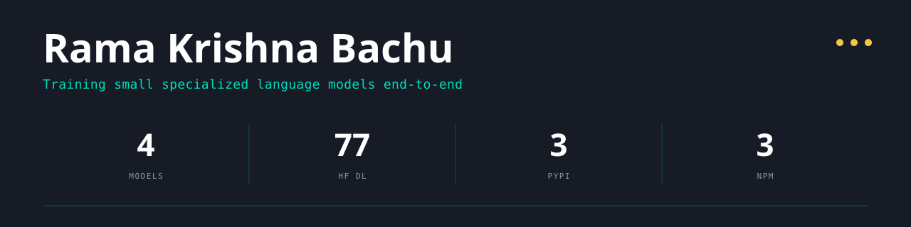

  

<em>Software Engineer at Lowe's · MS CS, University of New Haven · Independent SLM research as <a href="https://bottensor.xyz">Bottensor</a></em>

## Currently

<table>
  <tr>
    <td width="180"><b>Bottensor</b></td>
    <td>Open-source SLM research line. Training, serving, routing, and multi-agent orchestration as one stack. <a href="https://bottensor.xyz">bottensor.xyz</a></td>
  </tr>
  <tr>
    <td width="180"><b>polyrt</b></td>
    <td>Unified LLM runtime across MLX, Anthropic, and OpenAI. PyPI, v0.1.0.</td>
  </tr>
</table>

## Models on HuggingFace

Live download stats from the HuggingFace API, refreshed weekly.

  
  

  
  

Profile on <a href="https://huggingface.co/ramankrishna10">huggingface.co/ramankrishna10</a>

## Published research

| Date | Title | Summary | Links |
|------|-------|---------|-------|
| 2026-04 | **NPC Fast 1.7B** | SmolLM2-1.7B-Instruct, full-weight CPT to 16K + router LoRA SFT. 98.3% OOD router accuracy, 77.8% IFEval. | [DOI](https://doi.org/10.5281/zenodo.19771040) · [HF](https://huggingface.co/ramankrishna10/npc-fast-1.7b) |
| 2026-04 | **NPC Fin 32B** | Qwen2.5-32B-Instruct, 12×H100 ZeRO-3, 32K SFT examples. CryptoQA 93.6%, GPTQ 4-bit 19.2GB. | [DOI](https://doi.org/10.5281/zenodo.19802598) · [HF](https://huggingface.co/ramankrishna10/npc-fin-32b-sft) |
| 2026-04 | **Fin-PRM 7B** | Qwen2.5-7B QLoRA process reward model, 4-dim. Spearman 0.9234, F1 0.8421, ECE 0.21. | [DOI](https://doi.org/10.5281/zenodo.19800784) · [HF](https://huggingface.co/ramankrishna10/npc-fin-prm-7b) |
| 2026-05 | **NPC Agentic 7B v3** | Qwen2.5-7B QLoRA + benchmark harness. BFCL v4 / IFEval / AgentBench under identical vLLM 0.6.3 GPTQ W4A16 serving. | [DOI](https://doi.org/10.5281/zenodo.19954103) · [HF](https://huggingface.co/ramankrishna10/npc-agentic-7b-v3) · [bench](https://github.com/ramankrishna/bench-npc-agentic-v3) |

All preprints CC-BY-4.0 · Bottensor Independent Research · ORCID <a href="https://orcid.org/0009-0000-1298-0681">0009-0000-1298-0681</a>

## Open source

**Bottensor**

**@bottensor on npm**

**Standalone**

## Experience

| Role | Where | What |
|------|-------|------|
| Software Engineer | **Lowe's**, Charlotte NC | Event-driven microservices, 1M+ Kafka events/day for promotions and payments. Postgres + Couchbase data sync. Grafana observability. 10M+ digital gift card batch processing. |
| Software Engineer | **Accenture**, Hyderabad | Data ingestion with Redis / Solr / Kafka — 140% query perf gain across 100M+ requests. AWS S3 + Avro pipelines. Fault-tolerant microservices serving 20M+ users. |

## Connect

  
  
  
  

<em>Independent research. Affiliations represent personal interests, not employer.</em>

